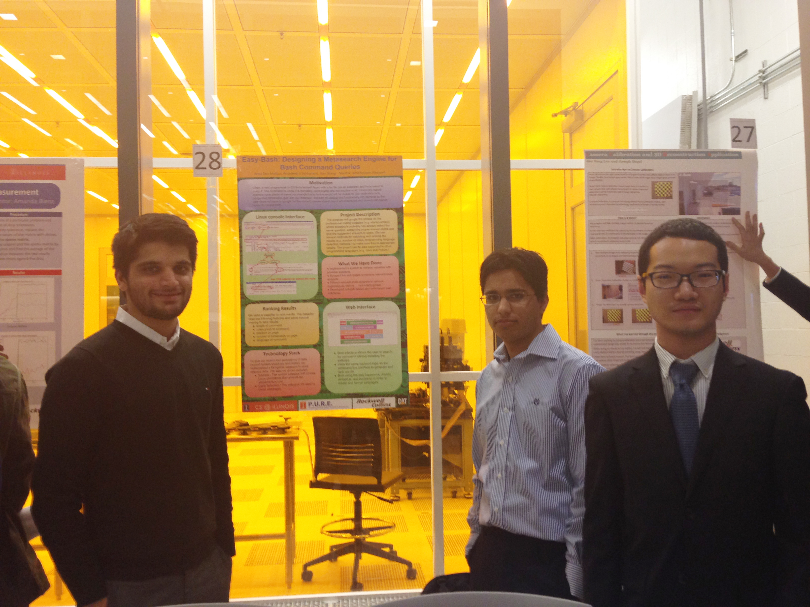

Easy-Bash-Research-Project
===============================
Source Code is avaliable via my mentor's account:
https://github.com/Aleyasen/LinuxAssist 

  

 A search engine program based on Google API that can translate English into command lines. This is a PURE research project completed by a group of 3 people. The poster for the research symposium and a photo of me together with other 2 teammates on the symposium are available in this depository

Source Code is avaliable via my mentor's account:
https://github.com/Aleyasen/LinuxAssist
 
